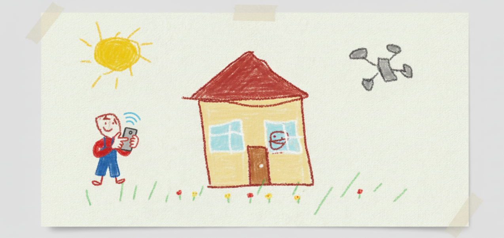

## Hi there 👋
So I like to code, but I talk a lot about that on here, so i'd like to use this space to talk another side of my life. I love cooking, admittedly, i'm not great at it, but that moment when you follow a recipe, and it actually turns out to taste super good? Nothing beats it. For a period of my College life, I was the president of my cooking club, I think some of my best memories unironically came from that club (I will never live down that knife I burned...)

I’m also into drones. While I always see “the next” OpenAI model getting tons of attention, drone applications seem to get way less. I think air + automation is the future of a lot of industries — the tech to change things is already here, but it feels like a lot of the jobs just aren’t being done.

Knowing that, you can probably guess what most of my projects are aimed at :D
### 🏆 Achievements
- Create-X Summer 2025
- [Georgia Tech Hackalytics 2025 Third in Healthcare Track](https://github.com/venkat1596/Hacklytics_Hackathon)
- Florida State University Hack Disaster 2023 Second Overall
### 🌱 I’m Currently learning...
* AI Engineering
 * Specifically I am learning about fine tuning on Small Language Models. I believe Small Language Models are the future, Fable sized models can only scale so much, and we have already seen so much progress from Models like [QWEN 9b](https://huggingface.co/Qwen/Qwen3.5-9B) 

### 🔭 I’m currently working on ...
* [Orgo AI]([https://github.com/SgainsO/Building-Damage-Assessment](https://www.alkenelabs.com/landing))
  * Orgo AI helps students solve chemistry problems that AI programs tends to make. Our focus here is on affordability of access unachievable by ai-based products
  * More information will be available by December of 2026 

### Some Cool Projects
#### FSU-ASLC-APP
* Developed a mobile app using React Native to inform students about ASLC events.
* Implemented a robust backend with AWS and PostgreSQL to power the app.
* Used tools like figma to propose possible UI designs
#### Damage Assesment
* This project was created in a coloboration with Kyiv university students to reduce costs in rebuilding cities
* Used AI models to estimate percent of building damage, and estimate cost to repair
* If you want to see the project that set me on my current trajectory
#### [Yourspot.cc](https://yourspot.cc/)
* A website that connects aspiring restaurant owners to their prospective owners through statistical models
<!--
**SgainsO/SgainsO** is a ✨ _special_ ✨ repository because its `README.md` (this file) appears on your GitHub profile.

Here are some ideas to get you started:

- 🔭 I’m currently working on ...
- 🌱 I’m currently learning ...
- 👯 I’m looking to collaborate on ...
- 🤔 I’m planning to learn...
- 💬 Ask me about ...
- 📫 How to reach me: ...
- 😄 Pronouns: ...
- ⚡ Fun fact: ...
-->
